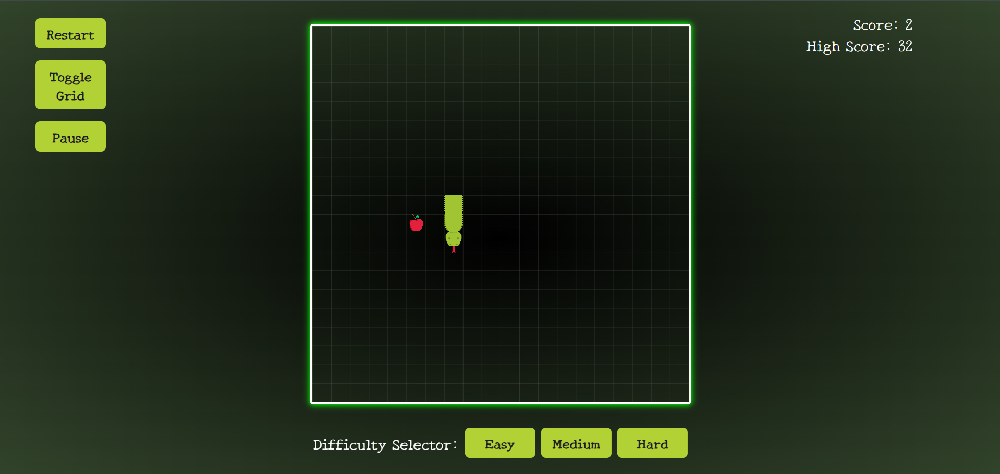

# 🐍 Snake Noir

A fun and visually enhanced clone of the classic Snake game — made with HTML, CSS, and JavaScript.

## 🚀 Features

- Smooth snake movement with keyboard controls (WASD / Arrow Keys)
- Eat apples to grow and increase your score
- Responsive UI with:
  - Play/Pause functionality
  - Show/Hide grid
  - Reset/Pause game
- High Score tracking using Local Storage
- Game Over animation and sound effects

## 📸 Screenshots




## 🛠️ Tech Stack

- **HTML**
- **CSS**
- **JavaScript (Vanilla)**

## 🔑 Controls

- **W / ↑** → Move Up  
- **S / ↓** → Move Down  
- **A / ←** → Move Left  
- **D / →** → Move Right  
- **Pause Button** → Pause/Resume the game  
- **Reset Button** → Restart the game  
- **Show Grid Button** → Toggle grid background

## 🔧 Setup Instructions

1. Clone this repo:
   ```bash
   git clone https://github.com/yourusername/snake-noir.git

2. Navigate to the project folder:
    ```bash
    cd snake-noir
3. Open index.html in your browser to play.

## 🌟 Live Demo

👉 [Play Snake Noir Online!](https://snakenoir.netlify.app)